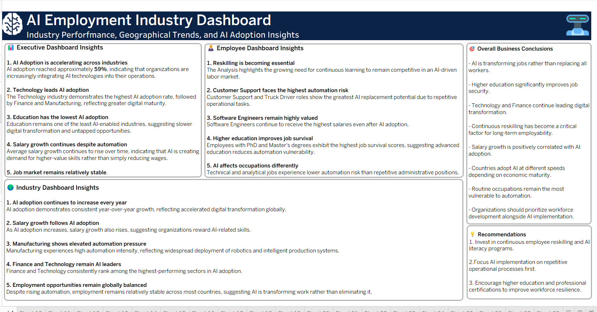
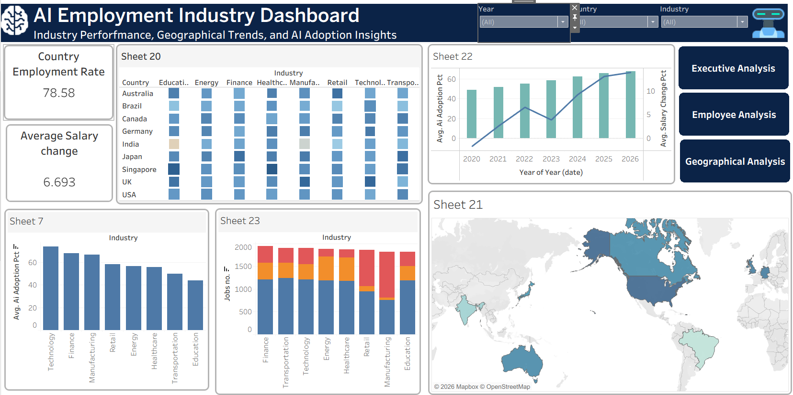
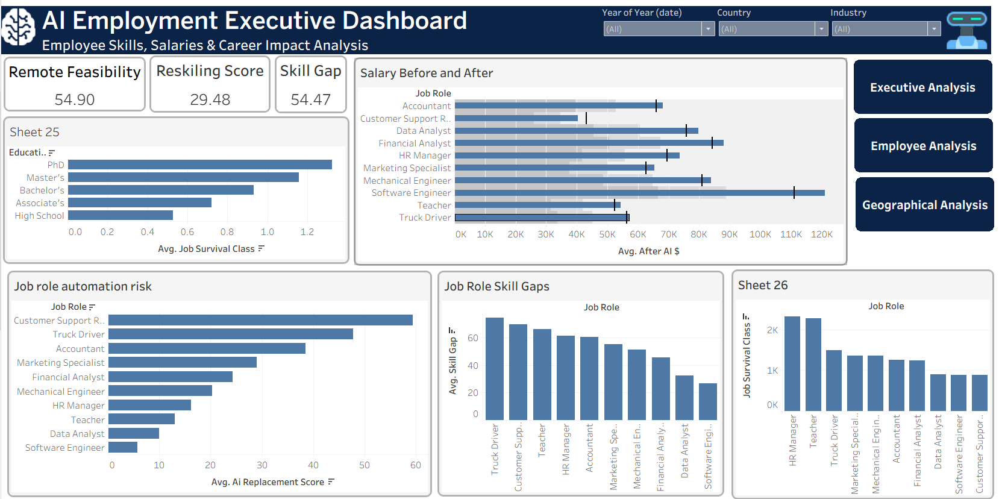
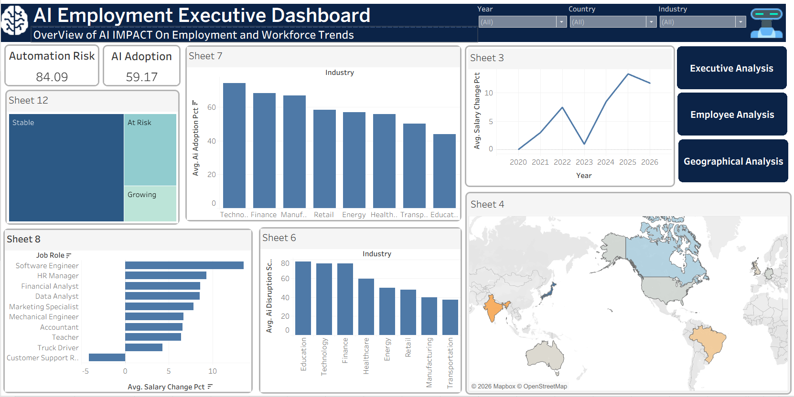
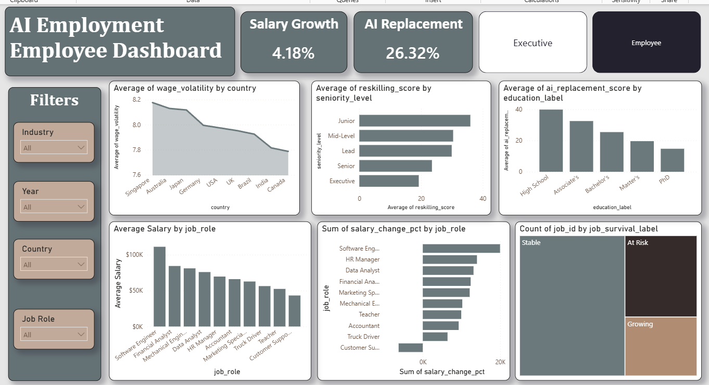
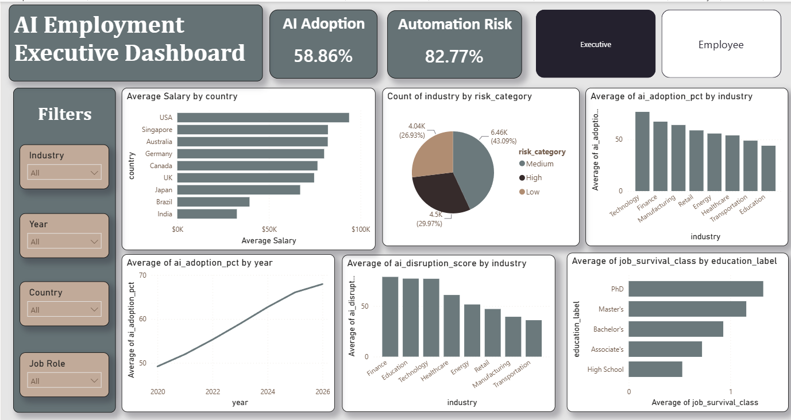

<div align="center">

# AI Employment Impact Analytics & Machine Learning

### An end-to-end analytics project examining how AI affects jobs, salaries, skills, industries, and labor vulnerability

[](#technology-stack)
[](#sql-data-warehouse)
[](#dashboard-gallery)
[](#dashboard-gallery)
[](#machine-learning-model)
[](#machine-learning-model)

</div>

---

## Project Overview

This project studies the impact of artificial intelligence on employment between
**2020 and 2026**. It combines data cleaning, exploratory analysis, dimensional
modeling, business intelligence, and machine learning in one complete workflow.

The analysis covers:

- **15,000 employment records**
- **43 workforce and AI indicators**
- **8 industries**
- **9 countries**
- **10 job roles**

The final machine-learning pipeline predicts an **AI Labor Vulnerability Score**
using workforce, industry, salary, task, and economic indicators.

## Business Questions

The project was designed to answer questions such as:

- Which industries are adopting AI fastest?
- Which occupations face the greatest automation and replacement risk?
- How does AI adoption relate to salary growth?
- Which skills and education levels improve job survival?
- Which countries and industries show the highest labor vulnerability?
- Can labor vulnerability be predicted without target leakage?

## End-to-End Workflow

```text
Raw Data
   ↓
Excel Cleaning and Initial Dashboards
   ↓
SQL Star-Schema Data Warehouse
   ↓
Power BI and Tableau Interactive Dashboards
   ↓
Python Feature Engineering and Machine Learning
   ↓
Business Insights and Workforce Recommendations
```

## Technology Stack

| Stage | Tools | Main Work |
|---|---|---|
| Data Cleaning | Excel, SQL, Python | Missing values, duplicates, inconsistent categories, validation |
| Data Modeling | MySQL Workbench, SQL | Star schema, fact and dimension tables, keys and relationships |
| Analysis | Excel, SQL, Python | KPIs, trends, segmentation, risk and salary analysis |
| Visualization | Excel, Power BI, Tableau | Executive, employee, industry, and geographic dashboards |
| Machine Learning | Python, scikit-learn, XGBoost, LightGBM | Regression benchmarking, tuning, cross-validation, prediction |
| Reporting | PowerPoint, Markdown | Business story, findings, and recommendations |

## Dataset and Analytical Scope

| Metric | Value |
|---|---:|
| Employment records | 15,000 |
| Indicators | 43 |
| Industries | 8 |
| Countries | 9 |
| Job roles | 10 |
| Train records | 12,000 |
| Test records | 3,000 |
| Model-ready features | 26 |
| Numeric features | 23 |
| Categorical features | 3 |

## Excel Analysis

Excel was used for the first stage of data preparation and business analysis:

- Standardized inconsistent values
- Corrected missing and invalid data
- Removed duplicate records
- Created formula-driven correction columns
- Built native PivotTables and PivotCharts
- Developed executive and employee dashboard views
- Prepared the cleaned data for SQL loading

The Excel workbook is available at:

```text
excel/AI_Employment_Analysis.xlsx
```

## SQL Data Warehouse

The SQL solution uses a **7-table star schema**:

```text
Fact_Employment
├── Dim_Country
├── Dim_Education
├── Dim_Industry
├── Dim_Job
├── Dim_Risk
└── Dim_Year
```

The SQL work includes:

- Fact and dimension-table creation
- Primary-key and foreign-key relationships
- Null and duplicate validation
- Data-quality checks
- Cleaning and standardization
- Approximately 29 reusable analytical views
- More than 70 analytical queries
- Executive, employee, career, behavioral, and geographic insights

SQL files:

```text
sql/
├── 01_data_cleaning.sql
├── 02_business_insights.sql
└── AI_Employment_Data_Model.mwb
```

## Dashboard Gallery

### Business Insights Summary



### Tableau — Industry and Geographic Analysis



### Tableau — Employee Analysis



### Tableau — Executive Analysis



### Power BI — Employee Dashboard



### Power BI — Executive Dashboard



## Machine Learning Model

### Objective

Predict the **AI Labor Vulnerability Score** while preventing target leakage
from variables that directly reconstruct or closely approximate the target.

### ML Pipeline

- Leakage-safe feature selection
- Removal of 17 target-adjacent or reconstruction variables
- Missing-value imputation
- Standard scaling for numeric features
- One-hot encoding for categorical features
- Identical preprocessing pipelines for all models
- Nine regression algorithms benchmarked
- Randomized hyperparameter search
- Five-fold cross-validation
- Permutation feature importance
- Model export and prediction template generation

### Models Benchmarked

1. Linear Regression
2. Ridge Regression
3. Lasso Regression
4. Decision Tree
5. Random Forest
6. Extra Trees
7. Gradient Boosting
8. XGBoost
9. LightGBM

### Final Model Performance

| Metric | Result |
|---|---:|
| Final model | Extra Trees — Optimized |
| Test R² | **0.9572** |
| Cross-validation R² | **0.9584** |
| CV standard deviation | **0.0072** |
| RMSE | **1.7517** |
| MAE | **1.2803** |
| Cross-validation folds | 5 |

The notebook is available at:

```text
machine-learning/AI_Labor_Vulnerability_Model.ipynb
```

## Key Findings

### Executive Insights

- Average AI adoption is approximately **59%** and continues to rise.
- Technology, Finance, and Manufacturing lead AI adoption.
- Education has the lowest AI-adoption level.
- Salary growth remains positive despite increasing automation.

### Employee and Career Insights

- Customer Support and Truck Driver roles show high replacement exposure.
- Software Engineers remain among the highest-paid occupations after AI adoption.
- Higher education is associated with stronger job-survival outcomes.
- Continuous reskilling is increasingly important for long-term employability.

### Industry and Geographic Insights

- Transportation and Retail show high average labor vulnerability.
- Manufacturing experiences significant automation pressure.
- India and Brazil show the highest average vulnerability scores.
- Australia and Singapore show comparatively lower vulnerability.
- Employment remains relatively stable despite growing AI adoption.

## Recommendations

1. Invest in continuous reskilling and AI-literacy programs.
2. Prioritize repetitive operational tasks for automation.
3. Support higher education and professional certifications.
4. Track labor vulnerability in addition to AI-adoption metrics.
5. Use predictive analytics to identify at-risk teams early.
6. Validate dashboard indicators before using them for workforce decisions.

## Repository Structure

```text
ai-employment-impact-analytics-ml/
│
├── README.md
├── MODEL_CARD.md
├── CV_DESCRIPTION.md
├── PUBLISHING_CHECKLIST_AR.md
├── requirements.txt
├── .gitignore
│
├── assets/
│   ├── 01-business-insights-summary.png
│   ├── 02-tableau-industry-geography.png
│   ├── 03-tableau-employee-analysis.png
│   ├── 04-tableau-executive-analysis.png
│   ├── 05-powerbi-employee-dashboard.png
│   └── 06-powerbi-executive-dashboard.png
│
├── excel/
│   └── AI_Employment_Analysis.xlsx
│
├── sql/
│   ├── 01_data_cleaning.sql
│   ├── 02_business_insights.sql
│   └── AI_Employment_Data_Model.mwb
│
├── dashboards/
│   ├── power-bi/
│   │   └── AI_Employment_Dashboard.pbix
│   └── tableau/
│       └── AI_Employment_Dashboard.twb
│
├── machine-learning/
│   └── AI_Labor_Vulnerability_Model.ipynb
│
└── presentation/
    └── AI_Employment_Impact_Presentation.pptx
```

## Running the Machine-Learning Notebook

Clone the repository:

```bash
git clone https://github.com/Nagato1pain2/ai-employment-impact-analytics-ml.git
cd ai-employment-impact-analytics-ml
```

Create and activate a virtual environment:

```bash
python -m venv .venv
```

Windows:

```bash
.venv\Scripts\activate
```

macOS/Linux:

```bash
source .venv/bin/activate
```

Install the dependencies:

```bash
pip install -r requirements.txt
```

Start Jupyter:

```bash
jupyter notebook
```

Then open:

```text
machine-learning/AI_Labor_Vulnerability_Model.ipynb
```

> The notebook searches multiple local and cloud paths for its dataset. Update
> the dataset path in the data-loading section when running it on a new machine.

## Opening the Dashboard Files

- Open the `.pbix` file with **Microsoft Power BI Desktop**.
- Open the `.twb` file with **Tableau Desktop** or Tableau Public.
- Open the `.xlsx` file with **Microsoft Excel**.
- Open the `.mwb` model with **MySQL Workbench**.
- Run the `.sql` scripts in the numbered order.

## Limitations

- Some dashboard indicators are based on synthetic or reconstructed employment data.
- Correlation between AI adoption and an employment outcome does not prove causation.
- Model performance should be validated on external and future datasets.
- Country and industry comparisons depend on the completeness and consistency of the source indicators.
- The model is intended for analytical and portfolio purposes, not automated employment decisions.

## Team

- **Mahmoud Ahmed — Project Manager**
- Esraa Fathy — Visualization Specialist
- Khaled Elserry — Data Engineer
- Sondos Mostafa — Data Analyst
- Directed by Dr. Amal Mahmoud

## Project Lead

**Mahmoud Ahmed**

- GitHub: [Nagato1pain2](https://github.com/Nagato1pain2)
- LinkedIn: [Mahmoud Ahmed — Data](https://www.linkedin.com/in/mahmoud-ahmed-data/)
- Email: [mahmoudahmed1147@gmail.com](mailto:mahmoudahmed1147@gmail.com)
- Phone: [01010700943](tel:+201010700943)

---

<div align="center">

### If this project is useful, consider giving the repository a star.

</div>
